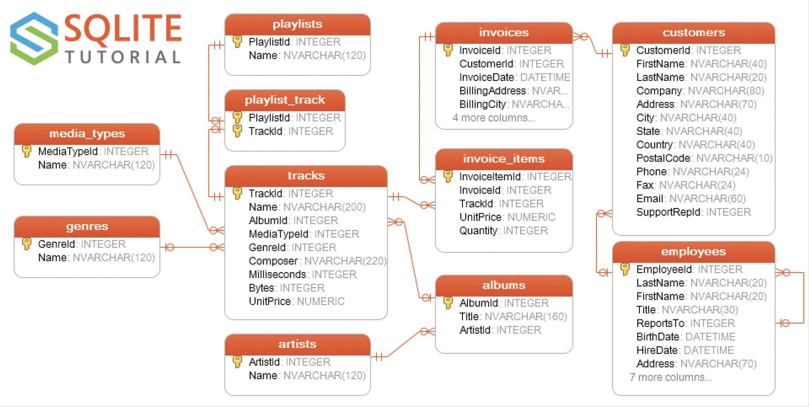

# FastAPI Presentation
# Introduction

This repository contains an example application used with a presentation about FastAPI. My goal for this repository making it a useful tool to help developers get up to speed to use the FastAPI framework to create APIs.

# FastAPI

## What Is FastAPI

FastAPI is a modern, high-performance web framework for building APIs with Python. It is an asynchronous framework that can handle many requests concurrently. It also takes good advantage of type hints to aid with development.

## Why Use FastAPI

The framework has many attractive features:

1. It has very high performance, comparable to NodeJS and Go
2. Developers gain coding performance improvements
3. Editors and IDEs have great support for FastAPI
4. It's a robust platform for creating production-ready code
5. Based on open standards for APIs, OpenAPI, previously known as Swagger

## Who Is Using FastAPI

Companies like Microsoft, Uber, Netflix, Expedia Group, and Cisco use FastAPI.

# Example Application

The code that makes up the bulk of this repository is a FastAPI web application that creates CRUD REST APIs to access a database. Rather than create a database from scratch, I used the [Chinook database](https://www.sqlitetutorial.net/sqlite-sample-database/) from the [SQLite Tutorial](https://www.sqlitetutorial.net/) website. This is a great resource to learn SQL and has a download link to the database.

I used the Chinook SQLite database for a couple of reasons:

1. I didn't have to build a database and populate it with data, which was a time-saver.
2. Because it's an "in process" database engine, it wasn't necessary to set up and configure another database engine, like MySQL, PostgreSQL, or SQL Server.

The ERD (Entity Relationship Diagram) of the database looks like this:



 The database has tables with one-to-many, many-to-many, and self-referential hierarchical tables, which I used to display FastAPIs abilities.

## REST Conventions

REST is more of a convention than a standardized protocol, and I used my conventions to create the REST URL endpoints.

The endpoints define a collection of "things" and access to a single "thing." Because they are things, nouns are used as names. I am careful when naming things to avoid awkward plural and singular nouns.

The CRUD behaviors are mapped to these HTTP method verbs:

| CRUD Method | HTTP Method | URL Endpoint        | Action on a thing                                            |
| :---------- | ----------- | ------------------- | ------------------------------------------------------------ |
| Create      | POST        | /api/v1/things      | Create new thing                                             |
| Read        | GET         | /api/v1/things      | Read collection of things                                    |
| Read        | GET         | /api/v1/things/{id} | Read singular thing as a URI (Universal Resource Identifier) |
| Update      | PUT         | /api/v1/things/{id} | Update entire thing                                          |
| Update      | PATCH       | /api/v1/things/{id} | Partially update thing                                       |

> [!NOTE]
>
> In this application, there is no Delete functionality. It's generally a bad idea to delete data from a database. I prefer to have something like an `active` flag that can be True or False to include or exclude the item from the interface. To do this would have meant modifying the Chinook database to add an `active` flag. Doing that would have made it more difficult to reset the database back to its default state, so I chose not to add delete functionality to the API.

## SQLModels

To reduce code duplication, the SQLModel library interacts with the database and combines SQLAlchemy and Pydantic nicely. Here is the `albums` table schema as defined by the database:

```sql
create table albums
(
    AlbumId  INTEGER       not null
        primary key autoincrement,
    Title    NVARCHAR(160) not null,
    ArtistId INTEGER       not null
        references artists
);


create index IFK_AlbumArtistId
    on albums (ArtistId);
```

This nicely describes the `albums` table schema and shows it contains a primary key named `AlbumIId`, a `Title` string 160 characters long, and a foreign key called `ArtisId` that references the primary key of another table called `artists`. It also creates an index on the `ArtistId` column to improve performance on join operations.

This works fine, but I want to change how my application works with the table without changing the `albums` table schema.

* I don't care for the naming convention used in the Chinook database for column names, and I'll map them to the naming conventions I prefer.

```python
from typing import Optional, List
from functools import partial

from sqlalchemy import Column, Integer, Index, ForeignKey
from sqlmodel import SQLModel, Field, Relationship
from pydantic import ConfigDict

from .fields import ValidationConstant, create_string_field

# create a specialized sqlmodel Field class that provides validation for the album title
TitleField = partial(
    create_string_field,
    "Album Title",
    "The title of the album",
    ValidationConstant.STRING_160,
)


class AlbumBase(SQLModel):
    """
    This is the base class for the Album model. All fields that are common to
    any derived classes are defined here.
    """
    title: str = TitleField(mapped_name="Title")
    artist_id: int = Field(
        sa_column=Column("ArtistId", Integer, ForeignKey("artists.ArtistId")),
    )


class Album(AlbumBase, table=True):
    """
    This is the Album model class. It represents an album in the database.
    It inherits from AlbumBase and is mapped to the "albums" table in the database.
    Notice the id primary key is marked as Optional, this is because the id is 
    not provided by the user, it is generated by the database. Notice too the
    artist and tracks relationships, these are defined as lists of objects. These
    values don't exist in the database, but are used to represent the related
    objects, and are populated by SQLAlchemy when the object is read from the
    as part of an ORM operation.
    """
    __tablename__ = "albums"

    id: Optional[int] = Field(
        default=None,
        sa_column=Column("AlbumId", Integer, primary_key=True),
        description="The unique identifier for the album",
    )
    # Define the relationship to Artist
    artist: "Artist" = Relationship(back_populates="albums")

    # Define the relationship to Tracks
    tracks: List["Track"] = Relationship(back_populates="album")

    model_config = ConfigDict(from_attributes=True)

    # make the model aware of the index on the artist_id column
    __table_args__ = (Index("IFK_AlbumArtistId", "ArtistId"),)


# Create operation
class AlbumCreate(AlbumBase):
    pass


# Read operation
class AlbumRead(AlbumBase):
    id: int

    model_config = ConfigDict(from_attributes=True)


# Update operation (Put)
class AlbumUpdate(AlbumBase):
    pass


# Patch operation
class AlbumPatch(AlbumBase):
    title: Optional[str] = TitleField(default=None)


from .artists import Artist  # noqa: E402
from .tracks import Track  # noqa: E402
```


## URL Endpoint Routes

## CRUD Operations

# Resources

[FastAPI Documentation](https://fastapi.tiangolo.com/)

[SQLite Tutorial](https://www.sqlitetutorial.net/)

This is a [YouTube](https://www.youtube.com/watch?v=pkILKAHScrc) video of a presentation I gave to a Python Users group about asynchronous coding. The first half is that presentation.


